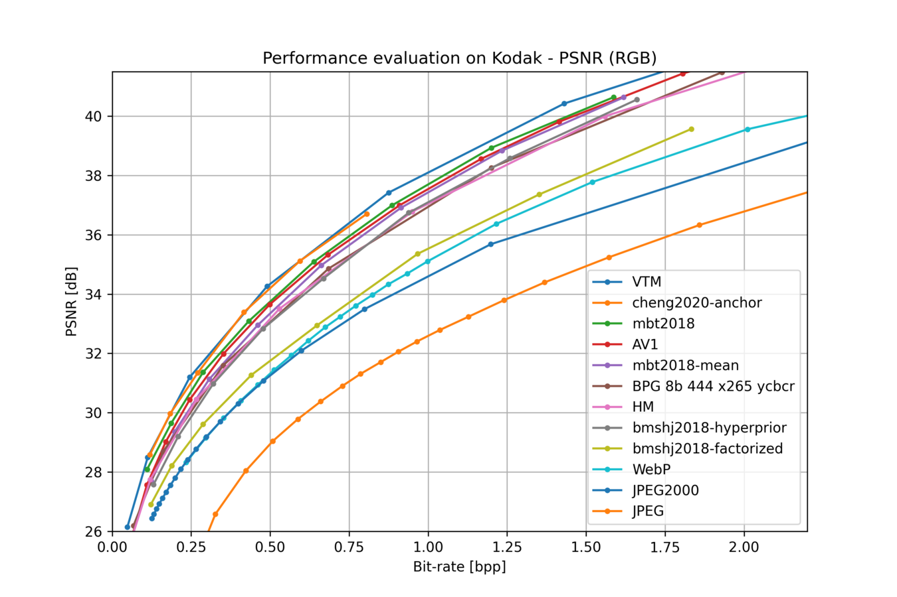

# CompressAI

[](https://github.com/InterDigitalInc/CompressAI/blob/master/LICENSE)
[](https://pypi.org/project/compressai/)
[](https://pypi.org/project/compressai/#files)

CompressAI (_compress-ay_) is a PyTorch library and evaluation platform for
end-to-end compression research.

CompressAI currently provides:

* custom operations, layers and models for deep learning based data compression
* a partial port of the official [TensorFlow compression](https://github.com/tensorflow/compression) library
* pre-trained end-to-end compression models for learned image compression
* evaluation scripts to compare learned models against classical image/video
  compression codecs




> **Note**: Multi-GPU support is now experimental.

## Installation

CompressAI supports python 3.6+ and PyTorch 1.7+.

**pip**:

```bash
pip install compressai
```

> **Note**: wheels are available for Linux and MacOS.

**From source**:

A C++17 compiler, a recent version of pip (19.0+), and common python packages
are also required (see `setup.py` for the full list).

To get started locally and install the development version of CompressAI, run
the following commands in a [virtual environment](https://docs.python.org/3.6/library/venv.html):

```bash
git clone https://github.com/InterDigitalInc/CompressAI compressai
cd compressai
pip install -U pip && pip install -e .
```

For a custom installation, you can also run one of the following commands:
* `pip install -e '.[dev]'`: install the packages required for development (testing, linting, docs)
* `pip install -e '.[tutorials]'`: install the packages required for the tutorials (notebooks)
* `pip install -e '.[all]'`: install all the optional packages

> **Note**: Docker images will be released in the future. Conda environments are not
officially supported.

## Documentation

* [Installation](https://interdigitalinc.github.io/CompressAI/installation.html)
* [CompressAI API](https://interdigitalinc.github.io/CompressAI/)
* [Training your own model](https://interdigitalinc.github.io/CompressAI/tutorials/tutorial_train.html)
* [List of available models (model zoo)](https://interdigitalinc.github.io/CompressAI/zoo.html)

## Usage

### Examples

Script and notebook examples can be found in the `examples/` directory.

To encode/decode images with the provided pre-trained models, run the
`codec.py` example:

```bash
python3 examples/codec.py --help
```

An examplary training script with a rate-distortion loss is provided in
`examples/train.py`. You can replace the model used in the training script
with your own model implemented within CompressAI, and then run the script for a
simple training pipeline:

```bash
python3 examples/train.py -d /path/to/my/image/dataset/ --epochs 300 -lr 1e-4 --batch-size 16 --cuda --save
```
> **Note:** the training example uses a custom [ImageFolder](https://interdigitalinc.github.io/CompressAI/datasets.html#imagefolder) structure.

A jupyter notebook illustrating the usage of a pre-trained model for learned image
compression is also provided in the `examples` directory:

```bash
pip install -U ipython jupyter ipywidgets matplotlib
jupyter notebook examples/
```

### Evaluation

To evaluate a trained model on your own dataset, CompressAI provides an
evaluation script:

```bash
python3 -m compressai.utils.eval_model checkpoint /path/to/images/folder/ -a $ARCH -p $MODEL_CHECKPOINT...
```

To evaluate provided pre-trained models:

```bash
python3 -m compressai.utils.eval_model pretrained /path/to/images/folder/ -a $ARCH -q $QUALITY_LEVELS...
```

To plot results from bench/eval_model simulations (requires matplotlib by default): 

```bash
python3 -m compressai.utils.plot --help
```

To evaluate traditional codecs:

```bash
python3 -m compressai.utils.bench --help
python3 -m compressai.utils.bench bpg --help
python3 -m compressai.utils.bench vtm --help
```

For video, similar tests can be run, CompressAI only includes ssf2020 for now:

```bash
python3 -m compressai.utils.video.eval_model checkpoint /path/to/video/folder/ -a ssf2020 -p $MODEL_CHECKPOINT...
python3 -m compressai.utils.video.eval_model pretrained /path/to/video/folder/ -a ssf2020 -q $QUALITY_LEVELS...
python3 -m compressai.utils.video.bench x265 --help
python3 -m compressai.utils.video.bench VTM --help
python3 -m compressai.utils.video.plot --help
```

## Tests

Run tests with `pytest`:

```bash
pytest -sx --cov=compressai --cov-append --cov-report term-missing tests
```

Slow tests can be skipped with the `-m "not slow"` option.


## License

CompressAI is licensed under the BSD 3-Clause Clear License

## Contributing

We welcome feedback and contributions. Please open a GitHub issue to report
bugs, request enhancements or if you have any questions.

Before contributing, please read the CONTRIBUTING.md file.

## Authors

* Jean Bégaint, Fabien Racapé, Simon Feltman and Hyomin Choi, InterDigital AI Lab.

## Citation

If you use this project, please cite the relevant original publications for the
models and datasets, and cite this project as:

```
@article{begaint2020compressai,
	title={CompressAI: a PyTorch library and evaluation platform for end-to-end compression research},
	author={B{\'e}gaint, Jean and Racap{\'e}, Fabien and Feltman, Simon and Pushparaja, Akshay},
	year={2020},
	journal={arXiv preprint arXiv:2011.03029},
}
```

## Related links
 * Tensorflow compression library by _Ballé et al._: https://github.com/tensorflow/compression
 * Range Asymmetric Numeral System code from _Fabian 'ryg' Giesen_: https://github.com/rygorous/ryg_rans
 * BPG image format by _Fabrice Bellard_: https://bellard.org/bpg
 * HEVC HM reference software: https://hevc.hhi.fraunhofer.de
 * VVC VTM reference software: https://vcgit.hhi.fraunhofer.de/jvet/VVCSoftware_VTM
 * AOM AV1 reference software: https://aomedia.googlesource.com/aom
 * Z. Cheng et al. 2020: https://github.com/ZhengxueCheng/Learned-Image-Compression-with-GMM-and-Attention
 * Kodak image dataset: http://r0k.us/graphics/kodak/

