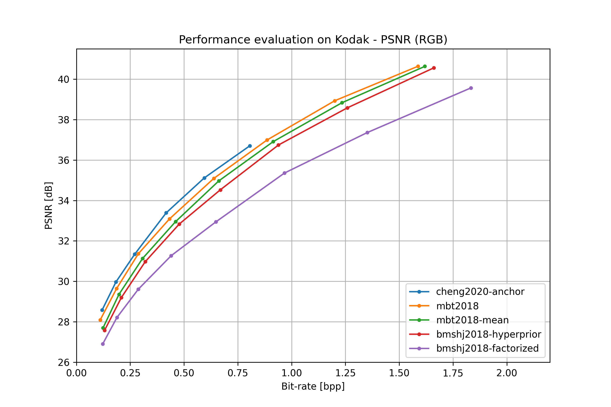
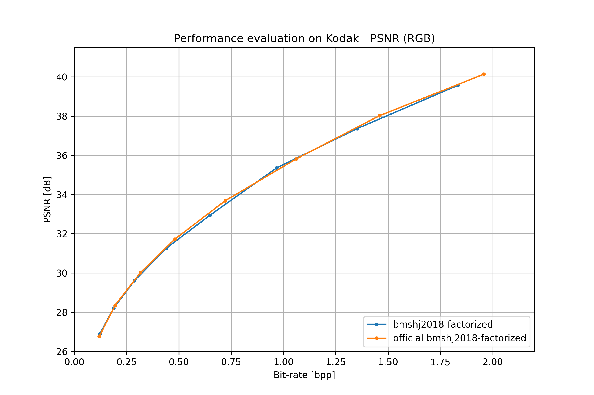
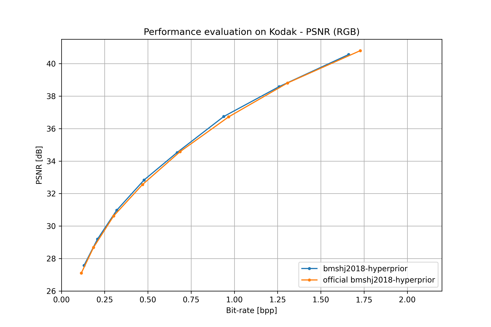
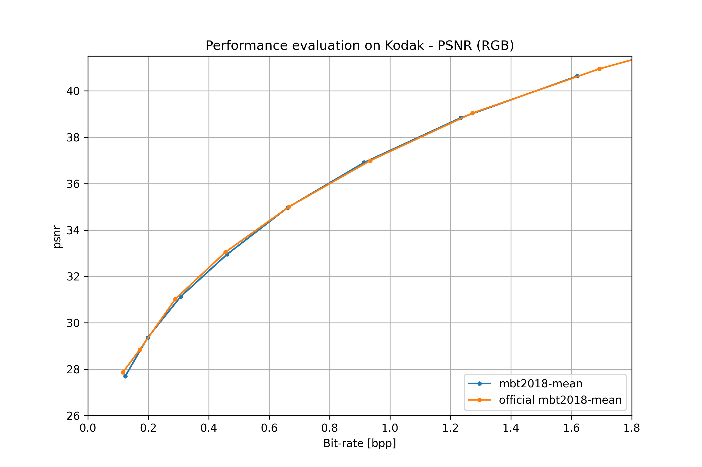
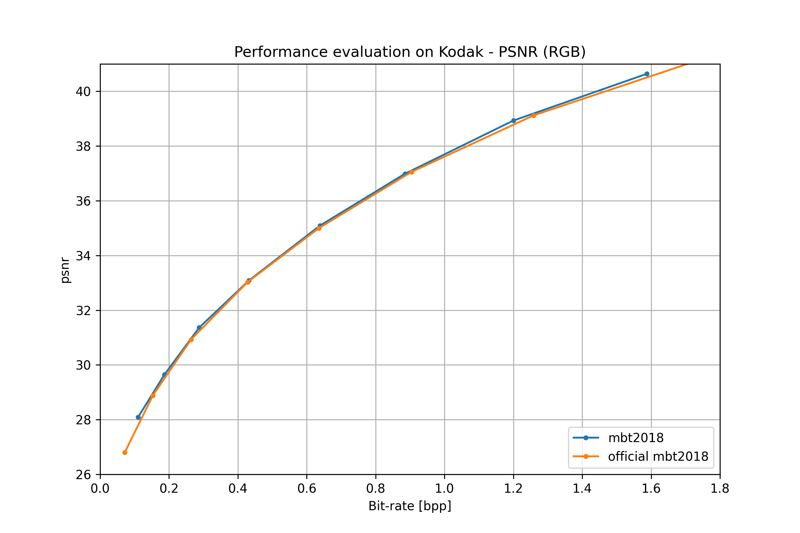

Image compression
=================

.. currentmodule:: compressai.zoo

This is the list of the pre-trained models for end-to-end image compression
available in CompressAI.

Currently, only models optimized w.r.t to the mean square error (*mse*) computed
on the RGB channels are available. We expect to release models fine-tuned with
other metrics in the future.

Pass :code:`pretrained=True` to construct a model with pretrained weights.

Instancing a pre-trained model will download its weights to a cache directory.
See the official `PyTorch documentation
<https://pytorch.org/docs/stable/model_zoo.html#torch.utils.model_zoo.load_url>`_
for details on the mechanics of loading models from url in PyTorch.

The current pre-trained models expect input batches of RGB image tensors of
shape (N, 3, H, W). H and W are expected to be at least 64. The images data have
to be in the [0, 1] range. The images *should not be normalized*. Based on the
number of strided convolutions and deconvolutions of the model you are using,
you might have to pad the input tensors H and W dimensions to be a power of 2.

Models may have different behaviors for their training or evaluation modes. For
example, the quantization operations may be performed differently. You can use
``model.train()`` or ``model.eval()`` to switch between modes. See the PyTorch
documentation for more information on
`train <https://pytorch.org/docs/stable/nn.html?highlight=train#torch.nn.Module.train>`_
and `eval <https://pytorch.org/docs/stable/nn.html?highlight=eval#torch.nn.Module.eval>`_.

.. contents:: Table of content
   :local:

Training
~~~~~~~~

Unless specified otherwise, networks were trained for 4-5M steps on *256x256*
image patches randomly cropped and extracted from the `Vime90K
<http://toflow.csail.mit.edu/>`_ dataset [xue2019video]_.

Models are trained with a batch size of 16 or 32, and an initial learning rate
of 1e-4 for approximately 1-2M steps. The learning rate is then divided by 2
when the evaluation loss reaches a plateau (we use a patience of 20 epochs).

Training usually take between one or two weeks to reach state-of-the-art
performances, depending on the model, the number of channels and the GPU
architecture used.

....

Models
~~~~~~

bmshj2018_factorized
--------------------
Original paper: [bmshj2018]_

.. autofunction:: bmshj2018_factorized

bmshj2018_hyperprior
--------------------
Original paper: [bmshj2018]_

.. autofunction:: bmshj2018_hyperprior

mbt2018_mean
------------
Original paper: [mbt2018]_

.. autofunction:: mbt2018_mean

mbt2018
-------
Original paper: [mbt2018]_

.. autofunction:: mbt2018

cheng2020_anchor
----------------
Original paper: [cheng2020]_

.. autofunction:: cheng2020_anchor

.. warning:: Pre-trained weights are not yet available

cheng2020_attn
--------------
Original paper: [cheng2020]_

.. autofunction:: cheng2020_attn

.. warning:: Pre-trained weights are not yet available

....

.. rubric:: Citations

.. [bmshj2018]

    .. code-block:: bibtex

        @inproceedings{ballemshj18,
          author    = {Johannes Ball{\'{e}} and
                       David Minnen and
                       Saurabh Singh and
                       Sung Jin Hwang and
                       Nick Johnston},
          title     = {Variational image compression with a scale hyperprior},
          booktitle = {6th International Conference on Learning Representations, {ICLR} 2018,
                       Vancouver, BC, Canada, April 30 - May 3, 2018, Conference Track Proceedings},
          publisher = {OpenReview.net},
          year      = {2018},
        }

.. [mbt2018]

    .. code-block:: bibtex

        @inproceedings{minnenbt18,
          author    = {David Minnen and
                       Johannes Ball{\'{e}} and
                       George Toderici},
          editor    = {Samy Bengio and
                       Hanna M. Wallach and
                       Hugo Larochelle and
                       Kristen Grauman and
                       Nicol{\`{o}} Cesa{-}Bianchi and
                       Roman Garnett},
          title     = {Joint Autoregressive and Hierarchical Priors for Learned Image Compression},
          booktitle = {Advances in Neural Information Processing Systems 31: Annual Conference
                       on Neural Information Processing Systems 2018, NeurIPS 2018, 3-8 December
                       2018, Montr{\'{e}}al, Canada},
          pages     = {10794--10803},
          year      = {2018},
        }

.. [xue2019video]
    .. code-block:: bibtex

        @article{xue2019video,
            title={Video Enhancement with Task-Oriented Flow},
            author={Xue, Tianfan and Chen, Baian and Wu, Jiajun and Wei, Donglai and 
            Freeman, William T},
            journal={International Journal of Computer Vision (IJCV)},
            volume={127},
            number={8},
            pages={1106--1125},
            year={2019},
            publisher={Springer}
        }

.. [cheng2020]
   .. code-block:: bibtex

        @inproceedings{cheng2020image,
            title={Learned Image Compression with Discretized Gaussian Mixture 
            Likelihoods and Attention Modules},
            author={Cheng, Zhengxue and Sun, Heming and Takeuchi, Masaru and Katto, 
            Jiro},
            booktitle= "Proceedings of the IEEE Conference on Computer Vision and 
            Pattern Recognition (CVPR)",
            year={2020}
        }]

....

Performances
~~~~~~~~~~~~

all models
----------

bmshj2018 factorized
--------------------

bmshj2018 hyperprior
--------------------

mbt2018 mean
------------

mbt2018
-------

